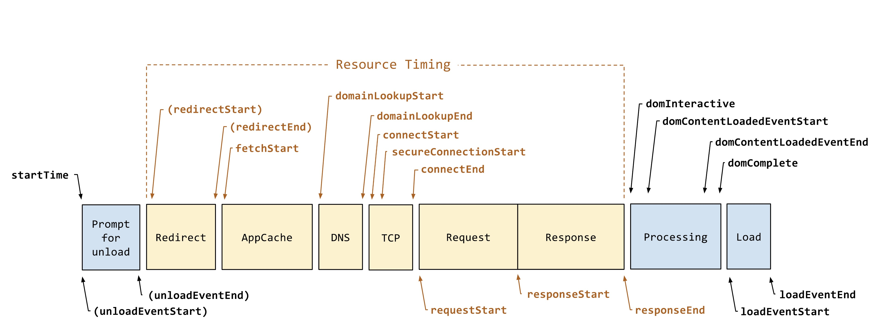
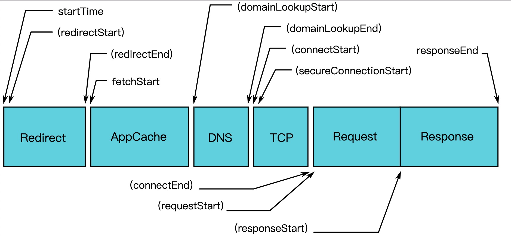

<!--
 * @Author: ymt
 * @Date: 2019-10-08 20:32:10
 * @LastEditors: ymt
 * @LastEditTime: 2019-12-13 09:25:27
 * @Description: file content
 -->
# knowledge
收藏、记录、学习

##  前端

### CSS

[常用 css](./css/common.md):memo:

[CSS 对于页面加载的影响](https://segmentfault.com/a/1190000018130499)

- css加载不会阻塞DOM树的解析
- css加载会阻塞DOM树的渲染
- css加载会阻塞后面js语句的执行、

### js
[常用 js](./js/common.md):memo:

[小数相关](https://github.com/SandBoat/knowledge/issues/1)

[js 错误类型](https://www.jianshu.com/p/ef9f0b1f7382)

### node
[狼叔：如何正确的学习Node.js](https://segmentfault.com/a/1190000013933520?utm_source=tag-newest)

node学习 - promise：
- [Node.js最新技术栈之Promise篇](https://cnodejs.org/topic/560dbc826a1ed28204a1e7de)
- [理解 Promise 的工作原理](https://cnodejs.org/topic/569c8226adf526da2aeb23fd)
- [Promise 迷你书](http://liubin.org/promises-book/)

### 工具 & 库
[zdog](https://github.com/metafizzy/zdog) - 3D 设计和动画制作库

[Git 各类问题解决方案](https://github.com/k88hudson/git-flight-rules/blob/master/README_zh-CN.md)

[vue-element-table 优化](https://github.com/xuliangzhan/vue-element-extends)

[vue 技术解析](https://ustbhuangyi.github.io/vue-analysis)

[【中高级前端必备】手摸手教你撸一个脚手架](https://juejin.im/post/5d37d982e51d45108c59a635)

[详细判断浏览器运行环境](https://juejin.im/post/5d0220a8f265da1bcc193c6c)

### 浏览器

**浏览器进程**

浏览器启动时，会新建一个浏览器进程、一个GPU进程、一个网络进程，所有标签页共享这些进程（包括隐身窗口）。渲染进程每个标签页独享，且标签业内跳转其他站点也会新建渲染进程
- 浏览器进程：主要负责界面显示、用户交互、子进程管理，同时提供存储等功能。
- 渲染进程：核心任务是将 HTML、CSS 和 JavaScript 转换为用户可以与之交互的网页，排版引擎 Blink 和 JavaScript 引擎 V8 都是运行在该进程中，默认情况下，Chrome 会为每个 Tab 标签创建一个渲染进程。出于安全考虑，渲染进程都是运行在沙箱模式下。
- GPU 进程：其实，Chrome 刚开始发布的时候是没有 GPU 进程的。而 GPU 的使用初衷是为了实现 3D CSS 的效果，只是随后网页、Chrome 的 UI 界面都选择采用 GPU 来绘制，这使得 GPU 成为浏览器普遍的需求。最后，Chrome 在其多进程架构上也引入了 GPU 进程。
- 网络进程：主要负责页面的网络资源加载，之前是作为一个模块运行在浏览器进程里面的，直至最近才独立出来，成为一个单独的进程。
- 插件进程：主要是负责插件的运行，因插件易崩溃，所以需要通过插件进程来隔离，以保证插件进程崩溃不会对浏览器和页面造成影响。

### 性能相关
[实战篇 - 如何实现和淘宝移动端一样的模块化加载 （task-silce）](https://juejin.im/post/5d33fd0f5188256e820c80d4)

[性能优化篇 - Performance（工具 & api）](https://juejin.im/post/5c8fa71d5188252d785f0ea3)

[前端代码质量-圈复杂度原理和实践](https://juejin.im/post/5da34216e51d4578502c24c5#heading-10)

[5 分钟撸一个前端性能监控工具
](https://juejin.im/post/5b7a50c0e51d4538af60d995)

- 本文只挑选了最为重要的两个指标进行监控：
    - 页面加载时间
    - 资源请求时间

- 页面加载

    ```js
    // getEntriesByType 是我们获取性能数据的一种方式。 
    const navTimes = performance.getEntriesByType('navigation')
    ```

    

- 资源加载

    ```js
    performance.getEntriesByType('resource')
    ```

    

### 文档/文章
[ECMAScript® 2019 Language Specification](http://ecma-international.org/ecma-262/)

[ECMAScript 5.1](http://es5.github.io/)

[90行代码，15个元素实现无限滚动](https://sale-dev.saas.crland.com.cn/customerManage/customerInputter) / [代码](https://codesandbox.io/s/react-wuxiangundong-i7ppg)

[Monorepo——大型前端项目的代码管理方式](https://segmentfault.com/a/1190000019309820)

[写给新手前端的各种文件上传攻略，从小图片到大文件断点续传](https://juejin.im/post/5da14778f265da5bb628e590)

[如何写出让同事好维护的代码](https://mp.weixin.qq.com/s/4wDViRrfJDlEQbLOoyH2xg)

- 名副其实

    好的变量名告诉你：是什么东西，为什么存在，该怎么使用

- 注释


    有表达力的代码是无需注释的。

    ```java
    // bad
    // check to see if the employee is eligible for full benefit
    if ((employee.flags & HOURLY_FLAG) && (employee.age > 65))

    // good
    if (employee.isEligibleForFullBenefits())
    ```

    一些好的注释

        1. 法务信息

        2. 对意图的注释，为什么要这么做

        3. 警示

        4. TODO注释

        5. 放大看似不合理之物的重要性

- 函数

    函数的单一职责

        一个函数应该只做一件事，这件事应该能通过函数名就能清晰的展示。
        判断方法很简单：看看函数是否还能再拆出一个函数。

    函数的抽象层级

        每个函数一个抽象层次，函数中的语句都要在同一个抽象层级，不同的抽象层级不能放在一起。
        比如我们想把大象放进冰箱，应该是这个样子的：

    ```
    def pushElephantIntoRefrige():
        openRefrige()
        pushElephant()
        closeRefrige()
    ```
    函数里面的三句代码在同一个层级（高度）描述了要完成把大象放进冰箱这件事顺序相关的三个步骤。显然，pushElephant这个步骤又可能包含很多子步骤，但是在pushElephantIntoRefrige这个层级，是无需知道太多细节的。

[Vue 单元测试 Vue Test Utils + Jest](./note/vueTest.md) :memo:

[调试Jest Chrome VsCode](https://www.chenng.cn/post/How-To-Debug-Jest-Tests.html)

[前端安全系列（一）：如何防止XSS攻击？](https://tech.meituan.com/2018/09/27/fe-security.html)

[一个合格(优秀)的前端都应该阅读这些文章](https://juejin.im/post/5d387f696fb9a07eeb13ea60)

[git rebase 危害](https://www.fossil-scm.org/fossil/doc/trunk/www/rebaseharm.md)


##  后端

## 优秀资源
### 书籍
[阮一峰 —— 互联网上的免费书籍](https://github.com/ruanyf/free-books)

[Webpack 指南](https://www.webpackjs.com/guides/)

[阿里工程师的自我修养.PDF](./阿里工程师的自我修养.pdf)

### 工具
[百度网盘不限速下载器](https://github.com/b3log/baidu-netdisk-downloaderx)

### 资源
[github emoji 库 ](https://www.webfx.com/tools/emoji-cheat-sheet/) :smile: 

[阿里图标库](https://www.iconfont.cn/home/index)

[github 每日趋势](https://github.com/trending) :fire:

[流体动画](https://github.com/PavelDoGreat/WebGL-Fluid-Simulation)

### 敏捷相关 & 团队
[猪齿鱼文档](https://choerodon.io/zh/docs/concept/)

[敏捷管理](https://mp.weixin.qq.com/s/xyMsn5p-_t0YW5h3yjM_Iw)

[gitflow](https://www.cnblogs.com/wish123/p/9785101.html)

[前端协作规范](https://juejin.im/post/5d3a7134f265da1b5d57f1ed)

## 待读 & 待分类
[前端大文件上传](https://juejin.im/post/5cf765275188257c6b51775f)